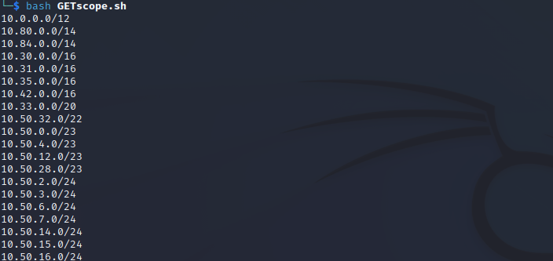

# Get Scope for Internal Pentest  

[]()  

### Download:  

```
pentest@whitebox:~# git clone https://github.com/Outs1d3r-Net/GETscope.git && cd GETscope
```

### RUN:  

```
pentest@whitebox:~# bash GETscope.sh
```

#### With great powers, great responsibilities.  

